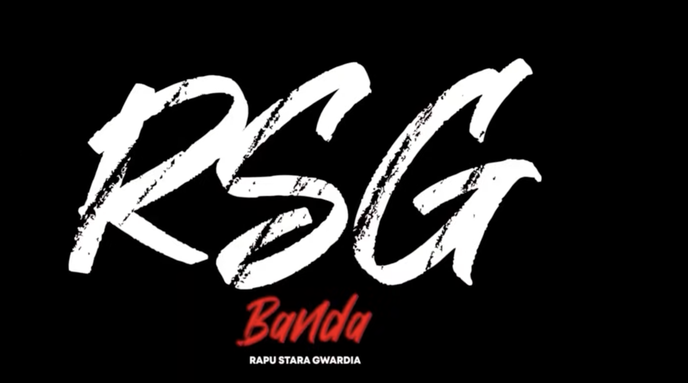

# 🎤 RSG BANDA

**Streetwear Shop + Muza + Bity**

Underground shop z ciuchami streetwear, muzyką i beatami prosto z polskiej sceny hip-hopowej.



---

## 🔥 Features

### 👕 STREETWEAR
- Hoodie, t-shirty, czapki, spodnie
- Dark navy + neon green design
- Aggressive underground aesthetic

### 🎵 MUZA
- Albumy, EP, single
- Underground rap bez cenzury
- Downloadable MP3 320kbps

### 🔥 BITY
- Trap, drill, boom-bap
- Licencje podstawowe i exclusive
- BPM info, play preview

---

## 🚀 Live Demo

**Coming soon:** https://rsgbanda.pl

---

## 💻 Tech Stack

- **Frontend:** Vanilla JS, HTML5, CSS3
- **Backend:** Node.js 18+, Express.js
- **Fonts:** Teko, Rajdhani, Barlow Condensed (Google Fonts)
- **Deployment:** Vercel + Cloudflare
- **Domain:** rsgbanda.pl (OVH.pl)

---

## 🛠️ Local Development

### Prerequisites
- Node.js 18+
- npm or yarn

### Installation

```bash
# Clone repository
git clone https://github.com/YOUR_USERNAME/rsg-banda.git
cd rsg-banda

# Install dependencies
cd app
npm install

# Start development server
npm start
```

Server runs on: **http://localhost:3000**

---

## 📦 Deployment

See [DEPLOYMENT.md](DEPLOYMENT.md) for detailed instructions.

### Quick Deploy to Vercel

```bash
# Install Vercel CLI
npm i -g vercel

# Deploy
vercel
```

---

## 📄 License

MIT License - see [LICENSE](LICENSE) file

---

## 🤝 Contributing

Pull requests welcome! See [CONTRIBUTING.md](CONTRIBUTING.md)

---

## 📞 Contact

- Website: https://rsgbanda.pl (coming soon)
- Email: contact@rsgbanda.pl

---

**RSG BANDA - Underground shop dla prawdziwych! 🔥**
